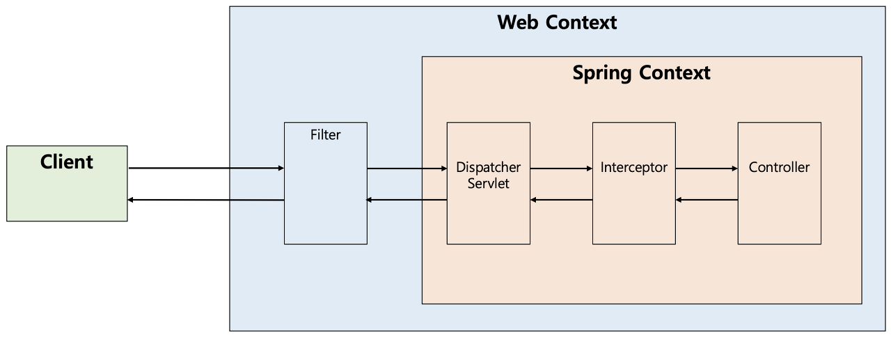

# Week4 WIL
## Swagger-UI
### Spring Docs
* `/swagger-ui.html` 접근 시 404 에러 발생
  * 당시 설정한 dependency 는 `org.springdoc:springdoc-openapi-ui:1.8.0`
  * **Spring Boot 3.0.X 이상부터는 위 dependency가 아닌 다른 dependency 가져와야 한다
  * `org.springdoc:springdoc-openapi-starter-webmvc-ui:2.5.0`
## Filter vs Interceptor

|                                        | Filter                                                                                                                                                              | Interceptor |
|----------------------------------------|---------------------------------------------------------------------------------------------------------------------------------------------------------------------|---|
| Container                              | Servlet Container                                                                                                                                                   | Spring Container |
| Able to Use Spring Framework Functions | X                                                                                                                                                                   | O |
| Able to Modify Request/Response        | O                                                                                                                                                                   | X |
| Use Case                               | authentication, authorization   Logging, Insepection on all Requests   Encoding/Decoding   Any functions that should be separated from Spring Framework | Business logic   Handle data before handing it over to Controller |
