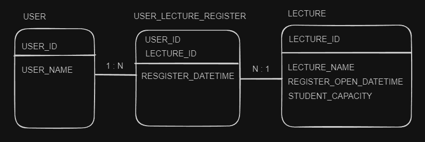

# 항해플러스 2주차 과제

---

## 과제 요구사항

### Description

- `특강 신청 서비스`를 구현해 봅니다.
- 항해 플러스 토요일 특강을 신청할 수 있는 서비스를 개발합니다.
- 특강 신청 및 신청자 목록 관리를 RDBMS를 이용해 관리할 방법을 고민합니다.

### Requirements

- 아래 2가지 API 를 구현합니다.
    - 특강 신청 API
    - 특강 신청 여부 조회 API
- 각 기능 및 제약 사항에 대해 단위 테스트를 반드시 하나 이상 작성하도록 합니다.
- 다수의 인스턴스로 어플리케이션이 동작하더라도 기능에 문제가 없도록 작성하도록 합니다.
- 동시성 이슈를 고려하여 구현합니다.

### API Specs

1️⃣ **(핵심)** 특강 신청 **API**

- 특정 userId 로 선착순으로 제공되는 특강을 신청하는 API 를 작성합니다.
- 동일한 신청자는 한 번의 수강 신청만 성공할 수 있습니다.
- 특강은 `4월 20일 토요일 1시` 에 열리며, 선착순 30명만 신청 가능합니다.
- 이미 신청자가 30명이 초과되면 이후 신청자는 요청을 실패합니다.

**2️⃣ (기본)** 특강 신청 완료 여부 조회 API

- 특정 userId 로 특강 신청 완료 여부를 조회하는 API 를 작성합니다.
- 특강 신청에 성공한 사용자는 성공했음을, 특강 등록자 명단에 없는 사용자는 실패했음을 반환합니다.

### 심화 과제

3️⃣ **(선택) 특강 선택 API**

- 단 한번의 특강을 위한 것이 아닌 날짜별로 특강이 존재할 수 있는 범용적인 서비스로 변화시켜 봅니다.
- 이를 수용하기 위해, 특강 엔티티의 경우 기존의 설계에서 변경되어야 합니다.
- 특강의 정원은 30명으로 고정이며, 사용자는 각 특강에 신청하기전 목록을 조회해볼 수 있어야 합니다.

#### 💡 KEY POINT

- 정확하게 30 명의 사용자에게만 특강을 제공할 방법을 고민해 봅니다.
- 같은 사용자에게 여러 번의 특강 슬롯이 제공되지 않도록 제한할 방법을 고민해 봅니다.

---

## 과제 시작 전..
### 1. ERD

* USER : 사용자(수강신청할 사람들)
* LECTURE : 강의 정보 관리
  * `REGISTER_OPEN_DATETIME` : 수강신청 오픈 일시 - 이 일시 이후에만 수강신청이 가능함
  * `STUDENT_CAPACITY` : 수강 신청 가능 인원
* USER_LECTURE_REGISTER : 수강신청 정보를 관리하는 테이블
### 2. Architecture
* 허재 코치님의 Clean Architecture + Layered Architecture
  * 각 Layer 간의 결함도를 최소한으로 하여 특정 Layer의 변경사항의 전파가 최소한으로 이뤄지도록 함.
  * BUT 작성해야 할 클래스가 많아 익숙하지 않으면 생산성이 조금 떨어질 수 있음
* 이석범 코치님 (2주차 멘토)
  * 허재 코치님보다 Layer의 수가 적음.
  * 생산성/유지보수성에 조금 더 초점. (그렇다고 Layer를 너무 적게 사용하는 것은 아님)
* Me
  * 우선 허재 코치님의 스타일대로 최대한 Layer를 나누어 볼 것.
  * 그렇게 최소한의 단위로 나눠진 Layer를 어떤 식으로 합쳐 나가면 적정 수준의 생산성과 이상적인 결합도를 달성할 수 있을지 고민해볼 것 
### 3. TDD
* 모든 클래스에 대한 단위 테스트 작성
* 단위 테스트로 작성할 수 없는 기능들에 대해서는 통합 테스트를 작성할 것.
### 4. Concurrency Issue
* 공부가 부족함 - 다음 주제들에 대해 공부해볼 것
  * Optimistic Lock, Pessimistic Lock
  * Transaction의 Isolation level

---

## What I Learned
### JPA
1. `data class`에 `@Entity` 설정하지 말 것
  * `data class`에서 기본적으로 override하는 메소드들로 인해 JPA에서 제공하는 복잡한 기능들에 성능 저하가 발생할 수 있음
  * reference : https://www.baeldung.com/kotlin/jpa
