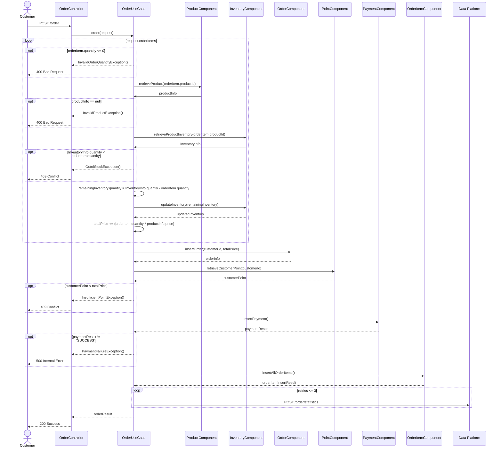
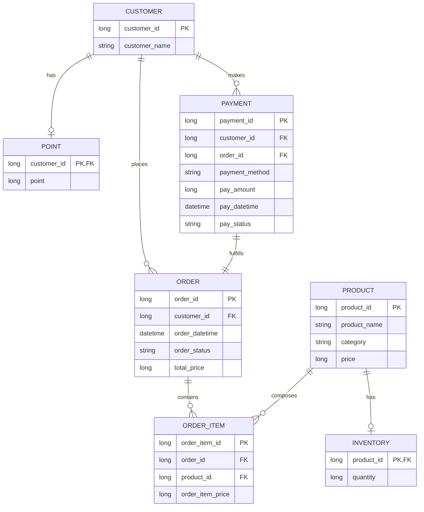

목 제거, 장바구니 조회

# 2. Sequence Diagrams
## 2-1. 포인트 충전

## 2-2. 상품 조회

## 2-3. 주문

# 3. ERD

* 재고에 대한 I/O가 많으므로 `PRODUCT`테이블로부터 분리하여 `INVENTORY`테이블로 관리함
* 주문 시 각 주문 상품에 대한 상태가 별도로 관리될 수 있으므로 `ORDER` 테이블과 `ORDER_ITEM` 테이블을 분리하여 관리